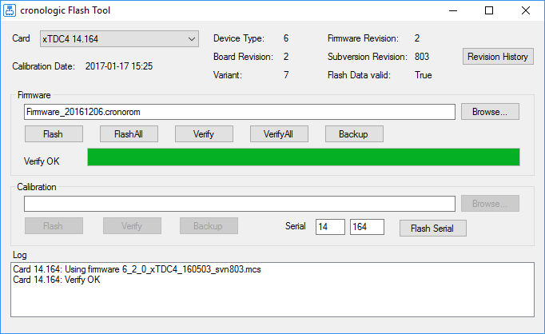
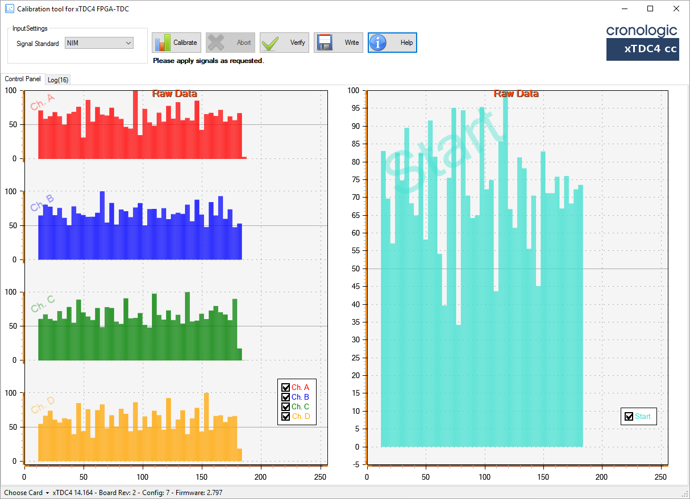

=============
Functionality
=============

The xTDC4 is a “classic” common-start time-to-digital converter.

It records the time difference between a leading or trailing edge on the start input
to the leading or trailing edges of the stop inputs (called **timestamps**).

Detection of rising and falling edges of the stop channels A–D can be enabled
individually.
Throughout this User Guide, transitions of the input signals are called **hits**.

The timestampls are quantized and are recorded in integer multiples of the 
data bin size of 5 ns / (3 × 128) ≈ 13.02083 ps.

The standard deviation of the timestamps is approximately 8 ps.

The maximum trigger rate on the start channel is **4 MHz**.

.. _sec difficult hits:

Handling of Difficult Hits
==========================

To measure all hits with the maximum resolution the hits must fulfill all criteria
set forth in this document.
However, the xTDC4 does include mechanisms to provide
as much information as possible for hits that fall out of these specs. 

Problematic hits, as listed below, will be flagged in the output *packets*
(see :ref:`sec data format`, in particular :c:member:`crono_packet.data`).

Short pulses
------------
To reliably detect hits, the signal has to be stable for at least 900 ps before
and after the edge that is to be measured.

However, pulses as short as 250 ps are usually detected at full resolution,
but have a significant chance to be assigned to the
wrong group or appear out of order.

For such hits :c:macro:`bit 7 <crono_packet.data.XTDC4_HIT_FLAG_COARSE_TIMESTAMP>`
in the data word is set.

Close hits
----------
Between multiple hits on a stop channel a dead time of approximately 5 ns is required
for full resolution.

Hits that are closer together will only be reported with a resolution of
5 ns / 6 ≈ 833.3 ps. For these hits both
:c:macro:`bits 6 and 7 <crono_packet.data.XTDC4_HIT_FLAG_COARSE_TIMESTAMP>`
are set.

High Hit-Rate
-------------
Data is copied from the 15-entry L0 FIFO to the larger downstream FIFOs at a rate
of about 12 MHz per channel. If the L0 FIFO overflows, the high resolution measurement
of some hits will be discarded.

In this case a measurement from an alternative TDC (referred to as *Delay-Line TDC*)
will be used that has a resolution of about 150 ps.
For these hits :c:macro:`bit 6 <crono_packet.data.XTDC4_HIT_FLAG_COARSE_TIMESTAMP>`
in the data word will be set.

.. _sec grouping:

Grouping and Events
===================

In typical applications, a start hit is followed by a multitude of stop hits.

The xTDC4 manages hits in groups (in some applications, a group of hits is
often called an “event”).

.. figure:: _figures/grouping.*
    :name: fig grouping
    :alt: Grouping principle of the xTDC4

    Principle of the grouping functionality.
    Only the orange hits where the leading edge falls in-between *start* and *stop* are
    grouped, others discarded. Alternatively, trailing edges or both edges may be used
    to determine if a hit should be kept.

:numref:`fig grouping` shows a corresponding timing diagram. For each Stop channel,
you can define the range within which events are grouped.
Hits outside that range are discarded.

Each Stop channel is configured by setting the
:c:member:`start <xtdc4_channel.start>` and
:c:member:`stop <xtdc4_channel.stop>` values of the corresponding
:c:member:`channel[i] <xtdc4_configuration.channel>`.

If a second start hit is recorded within the range of a group, the current group
is finished and a new group is started. Consecutive stop hits will be assigned
to the new group (as long as they are within the group range).

The standard group range is 0 ≤ *start* ≤ *stop* ≤ 2\ :sup:`30`–1.
If *stop* – *start* is larger than 2\ :sup:`24`–1, the data will contain
rollover
(see :c:macro:`XTDC4_HIT_FLAG_TIME_OVERFLOW <crono_packet.data.XTDC4_HIT_FLAG_TIME_OVERFLOW>`
for details).

*Start* and *stop* are in units of :c:member:`xtdc4_param_info.binsize`.

The maximum group range is 218.45 μs without rollover and 13.98 ms with rollover.

.. _sec auto trigger:

Auto-Triggering Function Generator
==================================

Some applications require internal periodic or random triggering.
The xTDC4 auto trigger function generator provides this functionality.

The delay between two trigger pulses of this trigger generator is the sum of two
components: A fixed value *M* and a pseudo-random value with a range given by the
exponent *N*.

The period is

.. math::

    T = M + [1 \dots 2^N] - 1

clock cycles with a duration of 4 ns per cycle.
xTDC4.

*M* and *N* are configured with
:c:member:`xtdc4_configuration.auto_trigger_period` and
:c:member:`xtdc4_configuration.auto_trigger_random_exponent`,
respectively. 

The trigger can be used as a source for the TiGer unit [see :ref:`sec tiger`].

.. _sec tiger:

Timing Generators (TiGer)
=========================

Each digital LEMO-00 input can be used as an LVCMOS trigger output.

The TiGer functionality can be configured for each connector independently.
See :c:struct:`xtdc4_tiger_block` for a full description of all configuration
options.

:numref:`fig tiger matrix` shows how the TiGer blocks are connected. They can be
triggered by an OR of an arbitrary combination of inputs, including the auto trigger.
Each TiGer can drive its output to its corresponding LEMO connector. This turns the
connector into an output.

The TiGer is DC coupled to the connector. Connected hardware must not drive any signals
to connectors that are used as outputs, as doing so could damage both the
xTDC4 and the external hardware. Pulses that are short enough for the 
AC-coupled inputs are available as input signals to the xTDC4. This can be used to
measure exact time differences between the generated output signals and input signals
on other channels.

.. figure:: _figures/xTDC4_tiger_matrix.*
    :name: fig tiger matrix
    :alt: Routing logic of the TiGer blocks of the xTDC4
    :width: 95%

    Routing logic of the TiGer blocks. The LEMO inputs can trigger the TiGer blocks,
    which can enable outputs on the LEMO connectors.

Performing a Firmware Update
============================

    Screenshot of the XTDC4's FirmwareGUI.

After installing the xTDC4 device driver, a firmware update tool is available.
By choosing *FirmwareGUI.exe* a firmware update can be performed
(the default location is under ``C:\Program Files\cronologic\TimeTagger4\apps\x64\``).
After invoking the
application, a window as shown in :numref:`fig flashtool` will appear. 
The tool can be used for updating the firmware and to create a backup of the on-board
calibration data of the xTDC4 unit. 

If several boards are present, the one which is going to be used can be selected in
the upper left corner of the window. 

When pressing one of the *Backup* buttons, a backup of the firmware or the calibration
data will be created, respectively. 

In order to perform a firmware update, chose the ``.cronorom``-file to be used by
pressing *Browse*. 
The file contains the firmware data. By pressing *Flash*, the firmware is written
to the board. 

*Verify* can be used to compare the firmware data stored on the xTDC4 to the one
provided by a file.

*Flash All* and *Verify All* perform the corresponding operation on all boards which
are installed.

.. attention::

    The new firmware will only be used by the board after a power cycle, i.e.
    after switching the PC (or Ndigo crate) off and back on. 

    A simple reboot is not sufficient. Therefore, the information shown in the
    upper half of the application window does not change right after flashing
    a new firmware.

.. note::

    After a firmware update, the xTDC4 must be re-calibrated in order for the
    Delay-Line TDC to work properly (see :ref:`sec difficult hits`).

Calibrating the Delay-Line TDC
==============================

    Screenshot of the XTDC4's Calibration Tool.

After each update of the xTDC4 firmware, the Delay-Line TDC must be calibrated. 

If you just performed a firmware update, make sure to power-cycle the xTDC4 before
starting the calibration procedure.

The calibration is done with the tool *XTDC4Calibration.exe*
(see :ref:`fig calibration`) which is available after
installing the xTDC4 device driver. 

Connect an external pulse signal to the Start and Stop channel inputs.
The signal must be low active. The pulse width must be between 10 ns and 200 ns.
The pulse frequency must not exceed 1 MHz. 

Use *Calibrate* to start the calibration procedure.
Follow the on-screen instructions to gather calibration data on all channels.
When all channels are calibrated use *Write* to permanently store the calibration
data in the xTDC4's on-board flash.

