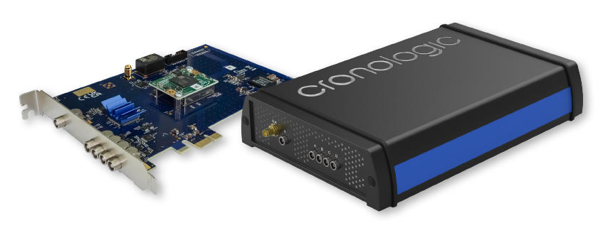

========
Hardware
========

The xTDC4 is available as a PCIe plugin board (variant “–PCIe”) or as a
desktop solution (variant “–TBT”). The two variants are shown in
:numref:`fig board overview`.

    Overview of the PCIe (left) and the TBT (right) variant of the xTDC4.

.. _sec installation:

Installing the PCIe Board
=========================

The xTDC4 board can be installed in any PCIe-CEM slot with x1 or more lanes.
Make sure that the PC is powered off and the main power connector is disconnected
while installing the board.

Input and Connectors
====================

:numref:`fig bracket` shows the location on the inputs on the slot bracket.
:numref:`fig schematic` shows a side view of the PCIe variant of the xTDC4.

.. figure:: _figures/xTDC4_Slotblende.*
    :name: fig bracket
    :alt: xTDC4 slot bracket
    :width: 50%

    Input connectors of the xTDC4 on the PCIe bracket.

.. figure:: _figures/xTDC4_schematic.*
    :name: fig schematic
    :alt: Schematic of the xTDC4 PCIe board.

    Schematic of the xTDC4 PCIe board. The connectors J12 and J25 are only
    present on Gen 1 boards.

LEMO-00 connectors are used for input connection. The inputs are **AC-coupled** and
have an impedance of 50 Ω. A schematic of the input circuit is shown in
:numref:`fig-input-circuit`.

.. figure:: _figures/InputCircuit.*
    :name: fig-input-circuit
    :alt: Input circuit of the xTDC4 TDC channels.
    :width: 35%

    Input circuit of the TDC channels.

The digital threshold for each input can be adjusted individually to comply with a
multitude of single-ended signaling standards
(see :c:member:`xtdc4_configuration.dc_offset`). The threshold can also be used
to configure the input for either positive or negative pulses.

The connectors can also be used as outputs. DC-coupled output pulses for automatic
internal triggering and control of external devices can be generated using the
:ref:`sec tiger`.

Only Gen 1 xTDC4 boards have inter-board connectors near the top edge of the 
board. The pinout of connector J12 is shown in :numref:`table j12 pinout`. The
connector J12 is reserved for future use.

.. table:: Pinout of connector J12.
    :name: table j12 pinout
    :align: center
    :width: 60%

    .. csv-table::
        :header: "Pin", "Name"
        :widths: 30, 70 

        "1, 2", "GND"
        "3, 4", "external CLK in N, external CLK in P"
        "5, 6", "GND"
        "7, 8", "reserved/NC"
        "9, 10", "GND"
        "11, 12", "reserved/NC"
        "13, 14", "GND"
        "15, 16", "reserved/NC"
        "17, 18", "GND"
        "19, 20", "reserved/NC"
        "21, 22", "GND"
        "23, 24", "reserved/NC"
        "25, 26", "GND"
        "27, 28", "reserved/NC"
        "29, 30", "GND"
        "31, 32", "reserved/NC"
        "33, 34", "GND"

Status LEDs of the PCIe boards
==============================

Three status LEDs are present on the board, as seen in :numref:`fig schematic`.

- LED1 lights up red during the configuration of the FPGA and turns off afterward.
  If it stays permanently lit, the configuration failed.
- LED2 lights up green after the board is initialized by the driver and turns off
  when the device is closed by the software.
- LED3 lights up green when capture is started, yellow after the first start signal
  was detected and red when groups are missing.

